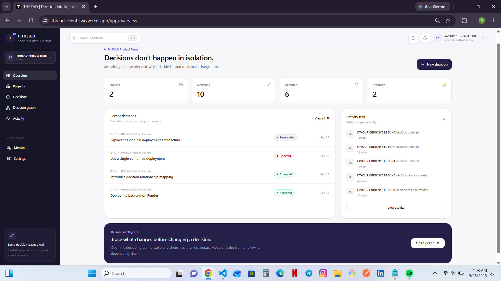
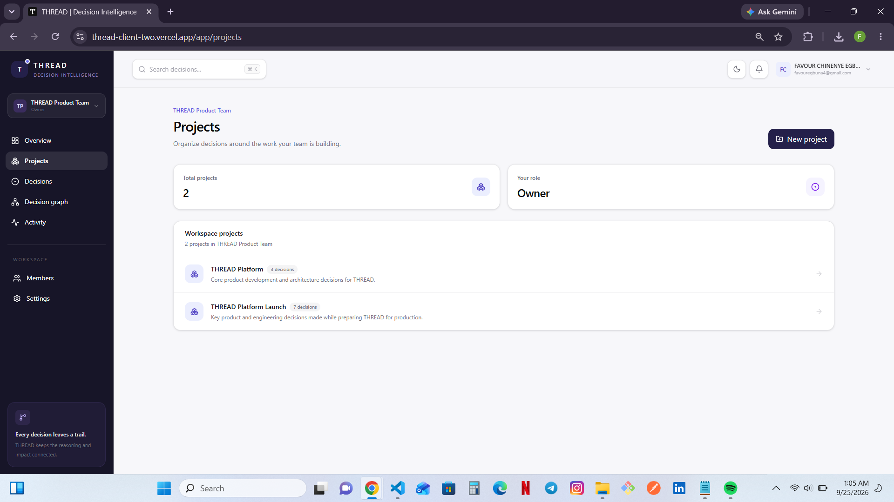
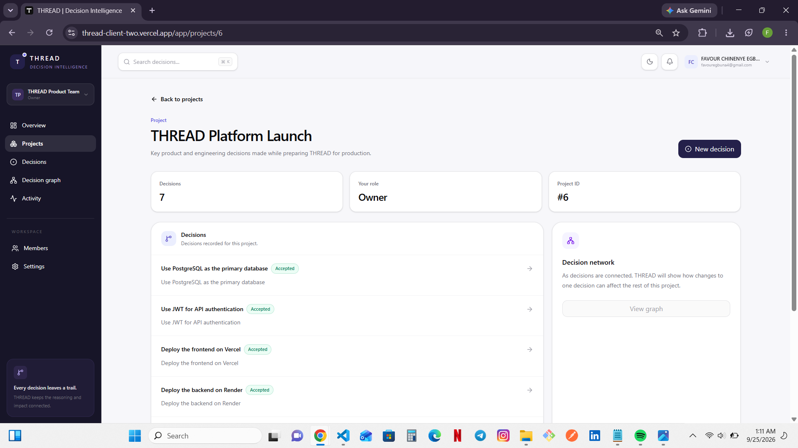
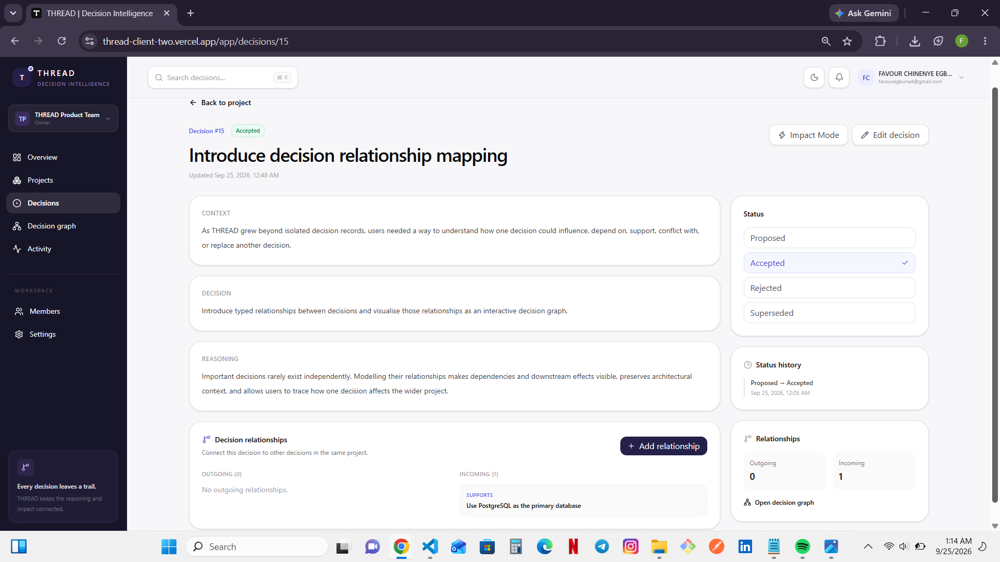
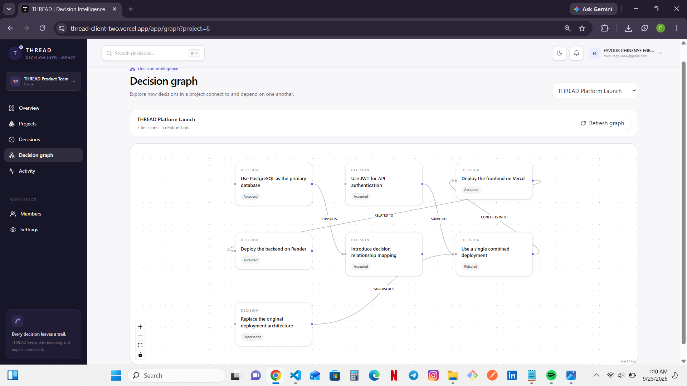

# THREAD - Decision Intelligence System

THREAD is a full-stack decision intelligence application designed to help teams capture important decisions, preserve the reasoning behind them, understand how decisions relate to one another, and maintain a traceable history as decisions evolve.

Instead of allowing important decisions to disappear into meetings, messages, or disconnected documents, THREAD provides a structured workspace where teams can organise projects, record decisions, connect related decisions, track status changes, and visualise their decision landscape.

## Live Application

**Frontend:** https://thread-client-two.vercel.app

**Backend API:** https://thread-api-1kwd.onrender.com

**API Health Check:** https://thread-api-1kwd.onrender.com/api/v1/health

## Backend Repository

https://github.com/FAVOUR-EGBUNA/thread-api

---

## Product Preview

### Workspace Overview

The overview brings projects, decision states, recent decisions, and workspace activity into one place so users can quickly understand what is happening across their decision environment.



### Project Organisation

Decisions are organised inside projects, allowing teams to separate different areas of work while keeping them within the same workspace.



### Project Decision Workspace

Each project provides its own decision workspace, showing the decisions recorded for that project together with their current lifecycle states.



### Decision Record

A decision preserves more than its final outcome. THREAD records the context, decision, reasoning, lifecycle status, status history, and relationships surrounding it.



### Decision Graph

Related decisions can be explored as an interactive graph, making dependencies, conflicts, support relationships, superseded decisions, and other connections visible.



---

## Overview

Important decisions rarely exist in isolation.

One decision may depend on another, conflict with an earlier choice, support a different direction, affect another part of a project, or eventually replace a previous decision.

THREAD was built to make those relationships visible.

The application gives users a structured environment for organising decisions inside projects and workspaces while preserving the context, reasoning, status history, relationships, and activity surrounding them.

The result is a decision record that explains not only what was decided, but how decisions connect and evolve over time.

---

## Core Features

### Authentication

Users can create accounts, sign in, and access protected application areas.

The frontend includes dedicated registration and login flows together with protected and guest-only routing.

### Workspaces

THREAD organises collaboration around workspaces.

Users can create and access workspaces that contain their projects, members, decisions, and activity.

An active workspace context allows the application to keep workspace-specific data and navigation coordinated across the interface.

### Workspace Members

Workspace membership allows teams to collaborate within the same decision environment.

The application provides interfaces for viewing and managing workspace members while the backend enforces workspace permissions.

### Projects

Projects provide a way to group related decisions inside a workspace.

Users can:

- Create projects
- View workspace projects
- Open individual projects
- Access decisions belonging to a project
- View project-level decision graphs

### Decisions

Decisions are the central records in THREAD.

Each decision can preserve:

- Title
- Context
- Decision
- Reasoning
- Status
- Project association
- Relationships
- Status history

This allows the reasoning behind important choices to remain accessible after the original conversation or meeting has ended.

### Decision Lifecycle

THREAD supports four decision states:

```text
PROPOSED
ACCEPTED
REJECTED
SUPERSEDED
```

This makes it possible to distinguish between decisions that are still being considered, decisions that have been accepted, decisions that were rejected, and decisions that were later replaced.

### Decision History

Status changes are preserved as part of a decision's history.

This creates a traceable record of how a decision changed over time rather than storing only its latest state.

### Decision Relationships

THREAD allows decisions to be connected using meaningful relationship types:

```text
DEPENDS_ON
AFFECTS
SUPPORTS
CONFLICTS_WITH
SUPERSEDES
RELATED_TO
```

These relationships help reveal dependencies, conflicts, supporting decisions, and downstream effects across a project.

### Decision Graph

THREAD uses React Flow through `@xyflow/react` to transform decision relationships into an interactive graph.

The graph provides a visual representation of connected decisions, helping users understand how choices within a project influence or relate to one another.

### Impact Analysis

Decision relationships can be used to examine the impact surrounding a particular decision.

This helps users move beyond viewing decisions as isolated records and instead understand their position within a wider decision network.

### Search

THREAD includes search functionality for finding relevant information without manually navigating through every project or decision.

### Activity

Workspace activity provides a historical view of meaningful actions performed within a workspace.

This gives users greater visibility into how the workspace and its decision records have changed.

### Responsive Interface

THREAD is designed to remain usable across different screen sizes while maintaining access to its primary workspace and decision-management features.

---

## Tech Stack

### Frontend

- React 19
- TypeScript
- Vite
- Tailwind CSS 4
- TanStack Query
- React Hook Form
- Zod
- React Router
- React Flow
- Lucide React
- date-fns

### Backend

The THREAD frontend communicates with a separate REST API built with:

- Node.js
- Express
- TypeScript
- PostgreSQL
- Prisma ORM
- Zod
- JWT Authentication

### Deployment

- Frontend: Vercel
- Backend: Render
- Database: PostgreSQL

---

## Application Architecture

THREAD uses a separated frontend and backend architecture.

```text
User
  |
  v
React + TypeScript Frontend
  |
  | REST API
  v
Node.js + Express API
  |
  v
Prisma ORM
  |
  v
PostgreSQL Database
```

The frontend is responsible for:

- User interface
- Routing
- Authentication state
- Workspace context
- Form handling
- Client-side validation
- Server-state management
- Decision presentation
- Decision graph visualisation
- Loading and error states

The backend is responsible for:

- Authentication
- Authorization
- Workspace permissions
- Business logic
- Data validation
- Decision lifecycle management
- Decision relationships
- Activity logging
- Persistence
- API security

---

## Frontend Structure

The frontend follows a feature-oriented structure.

```text
src/
|-- assets/
|-- components/
|   |-- auth/
|   `-- decisions/
|-- contexts/
|-- hooks/
|-- layouts/
|-- lib/
|-- pages/
|   |-- app/
|   `-- auth/
|-- routes/
|-- types/
|-- App.tsx
|-- index.css
`-- main.tsx
```

### Components

Reusable UI and application components, including authentication route guards and decision graph visualisation.

### Contexts

Application-wide context such as the currently active workspace.

### Hooks

Feature-specific hooks manage server state for:

- Workspaces
- Projects
- Decisions
- Members
- Activity

### Lib

The `lib` layer contains application utilities and API-facing modules for areas including:

- Authentication
- Workspaces
- Projects
- Decisions
- Members
- Activity
- Search
- Query configuration
- Theme handling
- Active workspace state

### Pages

THREAD contains dedicated application pages for:

- Overview
- Projects
- Project details
- Decisions
- Decision details
- Decision graph
- Workspace members
- Activity
- Settings
- Workspace setup

Authentication pages are separated into login and registration flows.

---

## Server-State Management

THREAD uses TanStack Query to manage asynchronous server state.

This provides a structured approach to:

- API requests
- Loading states
- Error states
- Query caching
- Data invalidation
- Synchronisation between the interface and backend

Feature-specific hooks keep API logic separated from presentation components.

---

## Forms and Validation

React Hook Form is used for form state management.

Zod provides schema-based validation for frontend input, while the backend independently validates incoming data before processing it.

This creates validation boundaries on both sides of the application.

---

## Routing

React Router manages application navigation.

THREAD separates public authentication routes from protected application routes using route guard components.

The application includes:

```text
GuestRoute
ProtectedRoute
```

This prevents authenticated application areas from being exposed through normal client-side navigation to unauthenticated users.

Backend authorization remains responsible for protecting the underlying data.

---

## Decision Visualisation

One of THREAD's central frontend features is its decision graph.

React Flow is used to represent decisions and their relationships visually.

A project's decisions can form a network where relationships such as:

```text
DEPENDS_ON
AFFECTS
SUPPORTS
CONFLICTS_WITH
SUPERSEDES
RELATED_TO
```

can be represented between decision nodes.

This gives users another way to understand complex project history beyond a traditional list interface.

---

## Getting Started

### Prerequisites

Make sure the following are installed:

- Node.js
- npm
- Git

### Clone the Repository

```bash
git clone https://github.com/FAVOUR-EGBUNA/thread-client.git
cd thread-client
```

### Install Dependencies

```bash
npm install
```

### Environment Variables

Create a `.env` file in the project root and configure the frontend API URL.

```env
VITE_API_URL=your_backend_api_url
```

For local development, point the frontend to the locally running THREAD API.

Example:

```env
VITE_API_URL=http://localhost:5000/api/v1
```

### Start Development Server

```bash
npm run dev
```

Vite will start the local development server.

The default local frontend URL is typically:

```text
http://localhost:5173
```

---

## Available Scripts

### Development

```bash
npm run dev
```

Starts the Vite development server.

### Build

```bash
npm run build
```

Runs the TypeScript build process and creates an optimised Vite production build.

### Lint

```bash
npm run lint
```

Runs ESLint across the project.

### Preview

```bash
npm run preview
```

Locally previews the generated production build.

---

## Backend

THREAD uses a separate backend repository for authentication, workspace permissions, business logic, decision relationships, activity logging, search, and PostgreSQL persistence.

**Repository:** https://github.com/FAVOUR-EGBUNA/thread-api

**Production API:** https://thread-api-1kwd.onrender.com

**Health Check:** https://thread-api-1kwd.onrender.com/api/v1/health

---

## Quality Assurance

THREAD has been tested across its core full-stack workflows.

The backend test suite contains:

```text
119 tests passed
```

TypeScript type checking and production deployment were also verified during development.

The deployed frontend and backend were tested together across the application's primary workflows.

---

## Engineering Highlights

THREAD goes beyond storing standalone records by modelling decisions as connected, evolving entities.

Key engineering challenges addressed in the project include:

- Modelling relationships between decisions
- Preserving decision lifecycle history
- Enforcing workspace-level access and permissions
- Synchronising frontend server state with a REST API
- Representing relational data as an interactive graph
- Maintaining authentication across protected routes
- Recording workspace activity
- Supporting project-scoped decision networks
- Validating data independently across frontend and backend boundaries
- Deploying the frontend and API as separate production services

---

## Project Purpose

THREAD was created as a portfolio-grade full-stack engineering project focused on solving a problem beyond standard CRUD functionality.

The project demonstrates:

- Full-stack application architecture
- React and TypeScript development
- REST API integration
- Authentication and protected routing
- Relational data modelling
- Workspace-based collaboration
- Role-based permissions
- Server-state management
- Form handling and schema validation
- Decision lifecycle modelling
- Historical state tracking
- Graph-based data relationships
- Interactive data visualisation
- Search
- Activity tracking
- Responsive frontend development
- Production deployment
- Automated backend testing

---

## Author

**Favour Egbuna**

Full-Stack Developer

GitHub: https://github.com/FAVOUR-EGBUNA
